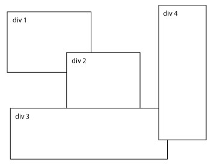
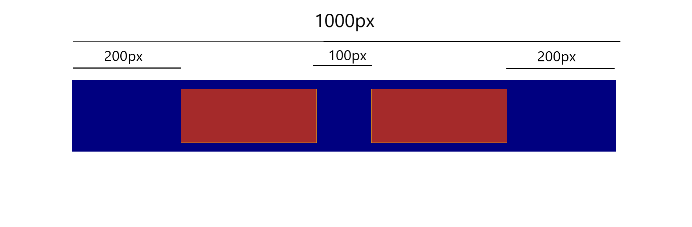
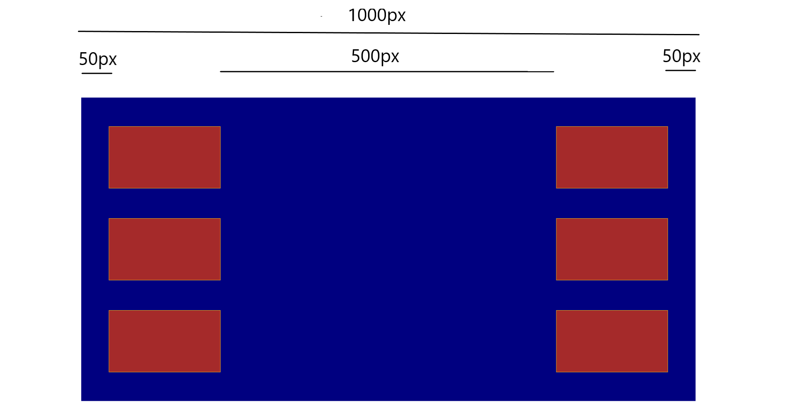

# Ejercicios de repaso de CSS

### 1. Sticky header
Crea un `header` (con su nav, botones de navegación, etc.) y varias secciones con texto dummy (lorem ipsum) para que haya scroll. A continuación, haz que el `header` se quede **"pegado"** a la parte superior de la pantalla cuando se hace scroll, y que el resto de la página pase por debajo.

#### Bonus track
Crea un `button` que diga "To Top" y colócalo en la esquina inferior derecha de la pantalla. El botón debe quedarse en esa posición cuando se haga scroll, siempre visible en su esquina, mientras el resto de la página pasa por debajo.

### 2. Chaotic layout
Usa la propiedad `position` para desarrollar el siguiente layout:



### 3. Hamburger button (sólo para los más valientes)
Usa tus conocimientos de la propiedad `position` para diseñar un **hamburger button**. Para ello, tendrás que averiguar por tu cuenta como funcionan los pseudoelementos `::before` y `::after`.

### 4. Cool button
Diseña un botón que, cuando se le haga `hover` con el ratón, tenga un efecto chulo. Puede ser como tú quieras: da rienda suelta a tu imaginación. Investiga en las posibilidades de la propiedad `transform`.

### 5. Texto desplazado
Crea un botón y un texto. El texto debe estar desplazado **fuera de la pantalla** por la derecha, no debe verse. Cuando se haga `hover` en el botón, el texto debe entrar en la pantalla desde su posición más allá del borde derecho. Haz que el movimiento sea suave y fluido.

#### Bonus track
En vez de desplazar el texto fuera de la pantalla, esta vez tiene que estar debajo del botón, pero debes hacer que sea **invisible**. Cuando se haga `hover` en el botón, el texto debe volverse **visible**, pero no bruscamente, sino poco a poco.

#### Bonus Track 2: La Venganza
Ahora deberás combinar ambos movimientos. El texto estará debajo del botón y será **visible**, pero cuando se haga `hover` sobre el botón, el texto se desplazará un poco (hacia donde quieras) y **luego** cambiará de color. Cuidado: primero debe desplazarse, y sólo cuando haya terminado el movimiento deberá cambiar de color.

### 6. Flexbox: no pixels
Tienes un HTML con una `section` y dentro dos `div`. Debes llegar al resultado que se enseña en **la imagen más abajo**, con una condición: **no puedes usar la propiedad `margin` en los divs rojos**. Copia y pega el CSS que te dejo aquí:

```
section {
    width: 1000px;
    height: fit-content;
    margin: 3rem auto;
    padding: 1rem 0;
    background-color: navy;

    /* Your code here: */


}

div {
    background-color: brown;

    /* Your code here: */


}
```

**No debes alterar en ningún momento el CSS que ya está escrito, pero puedes añadir nuevo en los lugares indicados (menos darle `margin` a los divs).**

El resultado debe ser el siguiente:



#### Bonus track
¿Sabrías cómo hacerlo sin dar ninguna `width` a los `div`, pero pudiendo darles `margin`? Yo no...

### 7. Flexbox: column challenge
Esta vez tienes una `section` y 6 `div`. Debes llegar al resultado que se muestra en la imagen, siendo el código de inicio el siguiente:

```
section {
    width: 1000px;
    height: 500px;
    margin: 3rem auto;
    background-color: navy;

    /* Your code here: */


}

div {
    /* Your code here: */


}
```



Esta vez no hay restricciones.

### 8. Grid: the Flexbox nemesis
Usando CSS Grid, crea estas 3 layouts **por separado**:


### 9. @media
Convierte el ejercicio anterior en **responsive**: 1 HTML, mucho CSS.

**Happy coding!!**